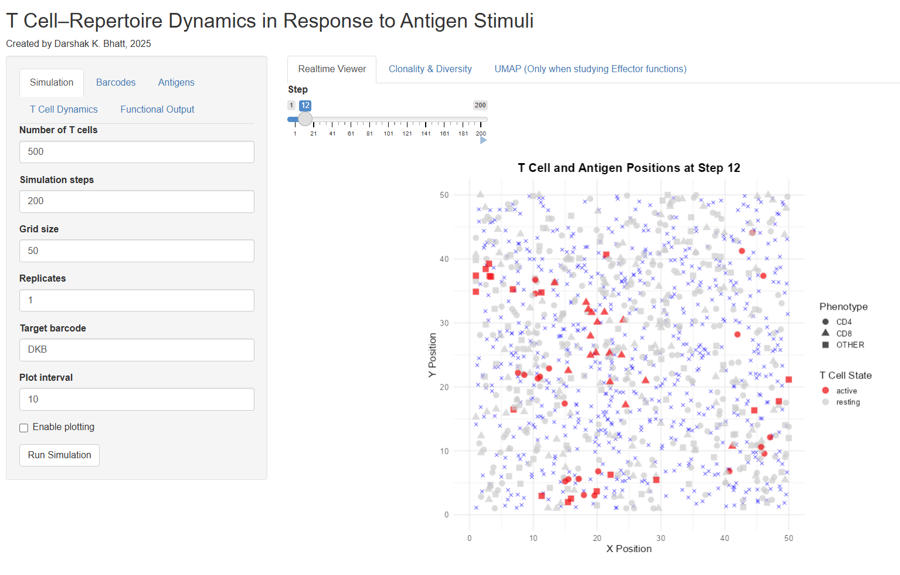
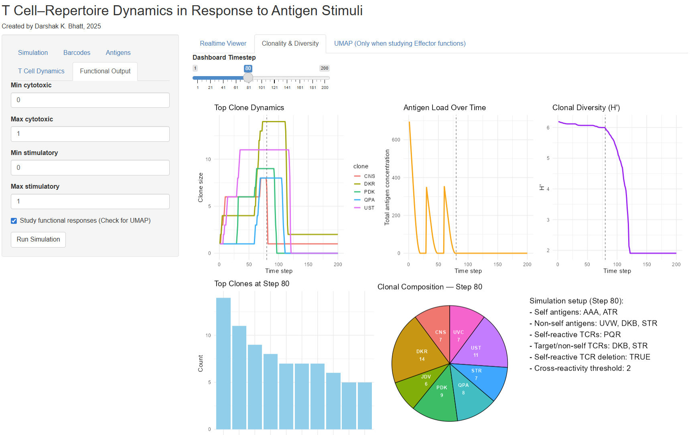
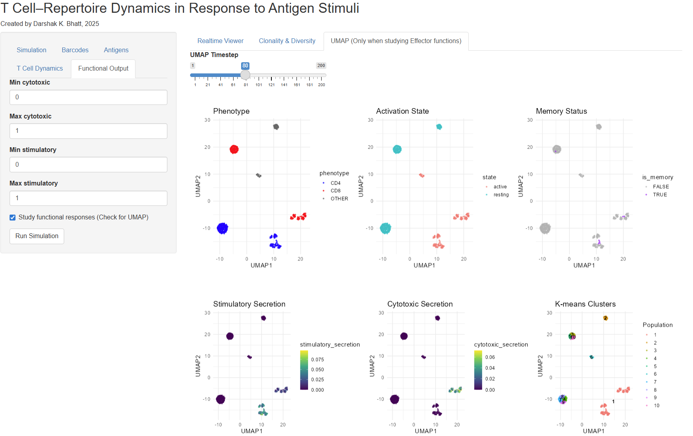

# TCR Model: T-cell repertoire dynamics in response to antigen stimuli 

</p

## Overview

The **TCR Model** simulates T-cell receptor (TCR) dynamics in response to antigen exposure, providing an interactive interface for exploring T-cell activation, proliferation, memory formation, and immune responses. The app allows users to simulate and visualize T-cell behavior in a spatial environment and track clonality, diversity, and functional responses (e.g., cytotoxic and stimulatory secretion).

## Features

- **Interactive Simulation**: Adjust parameters like T-cell count, antigen types, and simulation steps in real-time.
- **T-cell Dynamics**: Visualize T-cell activation, memory formation, and proliferation.
- **Clonality & Diversity**: Track top clones and measure clonal diversity (H’) over time.
- **UMAP Visualization**: Use UMAP to visualize T-cell features such as activation state, phenotype, and memory status.
- **Real-time Data**: View T-cell and antigen positioning at each simulation step.

## Clonality & Diversity Dashbaord

## UMAP Dashbaord for Single cell Analysis

## Citation

If you use this Shiny app in your research, please cite:

**D.K.Bhatt, 2025, "TCR Model: T-cell repertoire dynamics in response to antigen stimuli"** 

## Contributors

- **Creator(s)**: Darshak K. Bhatt
- **Affiliation**: University Medical Center Groningen, University of Groningen, The Netherlands
- **Contact**: darshakbhatt.com

## License

This project is licensed under the MIT License - see the [LICENSE.md](LICENSE.md) file for details.

---

### Additional Notes

Feel free to contribute to this repository by submitting pull requests for improvements, bug fixes, or new features.
